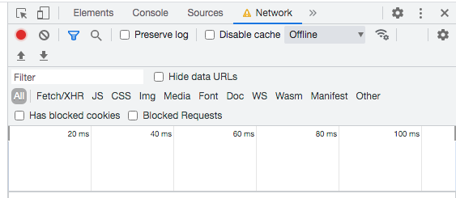
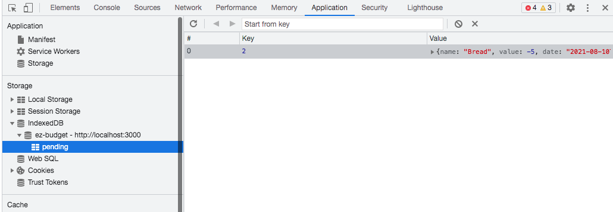
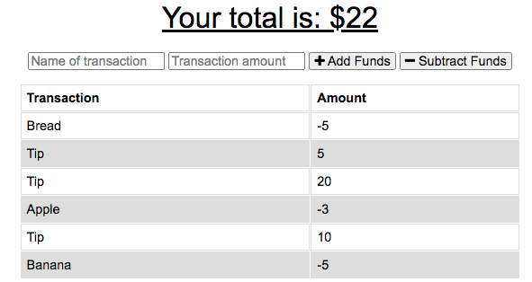
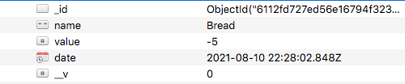

# ez-budget
uses PWA &amp; IndexedDB to track expenses, handles downed internet/data

## Table of Contents

  - [Description](#description)
  - [Technologies](#technologies)
  - [Deployment](#deployment)
  - [License](#license)
  - [Contact](#contact)
  - [Screenshots](#screenshots)

  ## Description

  This is a PC and mobile app designed to function as a budget tracker for any instancer where a user might be prone to poor data or spotty internet connectivity (remote locations, certain buildings, etc). EZ Budget allows the user to add funds and subtract expenses from their budget. If for whatever reason the internet were to go down, their expenses are saved in IndexedDB and when the internet is restored these are bulk posted to the Mongo Atlas database called ez-budget.
  
  ## Technologies:

  * Front-end: HTML, CSS, Js, service worker, IndexedDB
  * Back-end: mongoose, MongoDB, Robo 3T, express
  * Dev-deps: nodemon, Chrome's network/application features

  ## Deployment:

  Check out the app on Heroku:

  ## License
  
  
  
  ## Contact

  * If you have any questions/concerns regarding the app, please contact me on GitHub here (see portfolio for email): https://github.com/tedheikkila

## Screenshots

* home

    

* service worker registered

   

* throttling internet off

    

* transaction gets added to IndexedDB's pending

   

* app functions normally w/out data/internet

    

* when internet/data restored post request to Robot 3T db's ez-budget is completed

   

