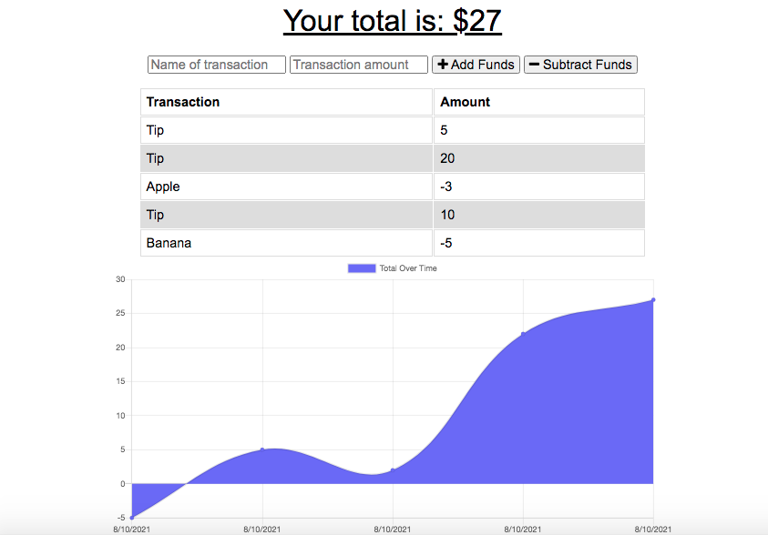
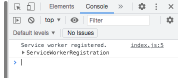

# ez-budget
uses PWA &amp; IndexedDB to track expenses to handle downed internet/data

## Table of Contents

  - [Description](#description)
  - [Technologies](#technologies)
  - [Deployment](#deployment)
  - [License](#license)
  - [Contact](#contact)
  - [Screenshots](#screenshots)

  ## Description

  This is a PC and mobile app designed to function as a placeholder.
  
  ## Technologies:

  * Front-end: HTML, CSS, Js
  * Back-end: 
  * Dev-deps: 

  ## Deployment:

  Check out the app on Heroku:

  ## License
  
  
  
  ## Contact

  * If you have any questions/concerns regarding the app, please contact me on GitHub here (see portfolio for email): https://github.com/tedheikkila

## Screenshots

* home

    

* placeholder

   

